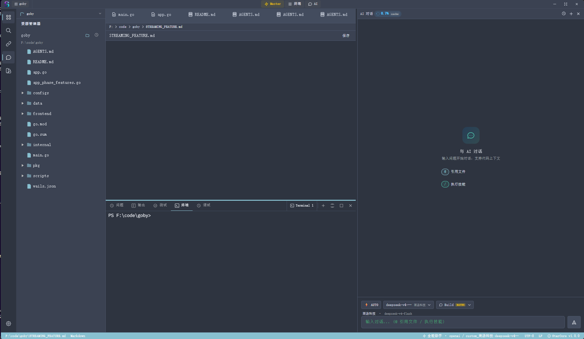
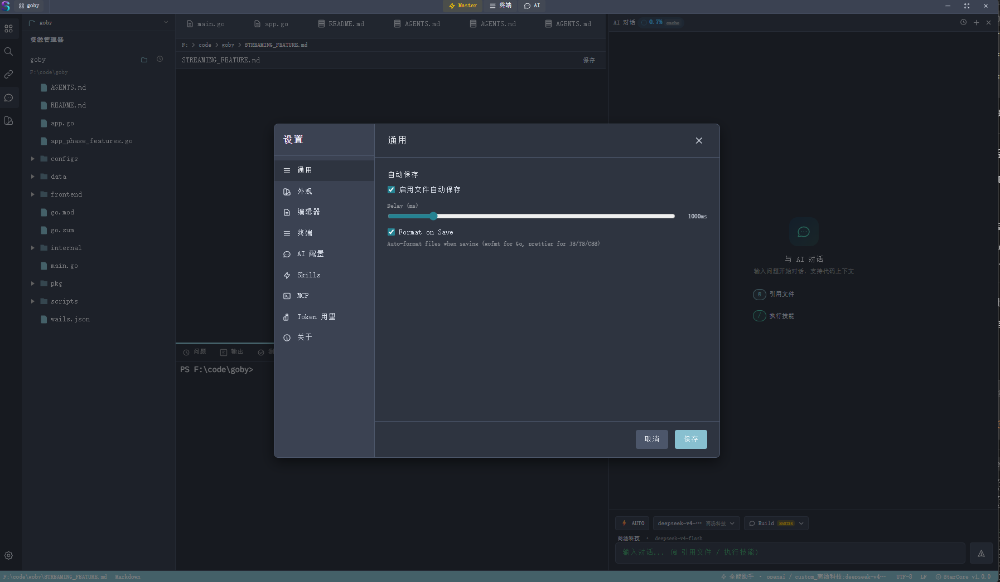

# StarCore IDE

**AI 驱动的下一代桌面 IDE** — 对标 Cursor / Claude Code，用 Go + Svelte 5 构建。

[](https://github.com/vpertj/StarCore/actions)
[](https://github.com/vpertj/StarCore/actions)
[](LICENSE)

---

## 截图



*IDE 主界面：左侧文件树 + CodeMirror 编辑器 + 底部终端 + 右侧 AI 对话面板*



*AI 对话面板：支持多 Agent、工具链可视化、技能触发（输入 `/技能名`）*

## 目录

- [核心特性](#核心特性)
- [系统架构](#系统架构)
- [Agent 编排引擎](#agent-编排引擎)
- [技术栈](#技术栈)
- [快速开始](#快速开始)
- [AI 提供商配置](#ai-提供商配置)
- [技能系统](#技能系统)
- [项目结构](#项目结构)
- [License](#license)

---

## 核心特性

- **多 Agent 系统** — 10 种专业角色（通用助手、前后端架构师、DevOps、QA、PM...），基于能力自动路由
- **21 个内置工具** — 文件 CRUD、命令执行、代码搜索、Git、HTTP、LSP、子代理等
- **自主任务执行** — Agent 循环最多 80 轮，自动调用工具、错误恢复、防偏离
- **上下文感知** — 项目结构分析、依赖图、RAG 语义搜索、知识库、智能压缩
- **多模型支持** — OpenAI / Anthropic / DeepSeek / Ollama（本地），自动故障转移
- **技能系统** — 24+ 内置技能，涵盖代码审查、测试、安全审计、SQL 优化、API 设计
- **完整 IDE** — CodeMirror 6 编辑器、Xterm.js 终端、Git 面板、文件浏览器、LSP 支持
- **跨平台** — Windows、macOS、Linux

---

## 系统架构

```
┌─────────────────────────────────────────────────────────────────┐
│                     前端 (Svelte 5)                              │
│  ┌──────────┐  ┌──────────┐  ┌──────────┐  ┌────────────────┐  │
│  │  AI 面板  │  │ 代码编辑器│  │   终端   │  │ Git/文件面板   │  │
│  └────┬─────┘  └──────────┘  └──────────┘  └────────────────┘  │
│       │ Wails 事件系统                                            │
├───────┼─────────────────────────────────────────────────────────┤
│       │                 后端 (Go 1.23)                           │
│  ┌────┴─────────────────────────────────────────────────────┐   │
│  │                    AI 服务层                               │   │
│  │  ┌──────────┐  ┌──────────┐  ┌──────────┐  ┌──────────┐  │   │
│  │  │  Agent   │  │ 上下文   │  │ Provider │  │  记忆    │  │   │
│  │  │  循环    │  │ 构建器   │  │ 管理器   │  │  存储    │  │   │
│  │  └────┬─────┘  └──────────┘  └──────────┘  └──────────┘  │   │
│  │       │                                                     │   │
│  │  ┌────┴─────────────────────────────────────────────────┐  │   │
│  │  │              工具执行层                               │  │   │
│  │  │ 21 工具 │ 子代理 │ 技能 │ LSP │ MCP                 │  │   │
│  │  └─────────────────────────────────────────────────────┘  │   │
│  └───────────────────────────────────────────────────────────┘   │
└─────────────────────────────────────────────────────────────────┘
```

---

## Agent 编排引擎

### Agent 循环（核心引擎）

Agent 循环是 StarCore 自主编程能力的核心，管理整个 AI 任务生命周期：

```
用户请求
    │
    ▼
┌─────────────────┐
│ 意图分类器       │ ──→ 判断任务类型（编码、调试、重构、审查...）
└────────┬────────┘
         │
         ▼
┌─────────────────┐
│  Agent 路由器    │ ──→ 根据意图 + 能力选择最优 Agent
└────────┬────────┘
         │
         ▼
┌─────────────────────────────────────────────────────────────┐
│                 Agent 循环（最多 80 轮）                      │
│                                                              │
│  ┌─── 每轮迭代 ──────────────────────────────────────────┐  │
│  │                                                        │  │
│  │  1. 构建上下文（稳定前缀 + 动态后缀）                   │  │
│  │     ├─ Git 状态 + 代码结构分析                          │  │
│  │     ├─ 项目规则（.starcorerules）                       │  │
│  │     ├─ 知识库 + RAG 结果                                │  │
│  │     ├─ 活动文件 + 选中代码                              │  │
│  │     └─ 对话历史（压缩处理）                             │  │
│  │                                                        │  │
│  │  2. 注入循环状态                                        │  │
│  │     ├─ Todo 列表 + 进度百分比                           │  │
│  │     ├─ 已修改文件                                       │  │
│  │     ├─ 关键决策（最多 5 条，FIFO）                      │  │
│  │     └─ 防偏离：每 10 轮重新注入原始目标                 │  │
│  │                                                        │  │
│  │  3. 调用 LLM（重试 + 熔断器）                           │  │
│  │     ├─ 流式响应                                         │  │
│  │     ├─ 重复检测（循环时中断）                           │  │
│  │     └─ 工具调用解析（function calling + 文本）          │  │
│  │                                                        │  │
│  │  4. 并行执行工具                                        │  │
│  │     ├─ 超时：60 秒（需审批的 6 分钟）                   │  │
│  │     ├─ 结果截断（动态预算，最大 12K 字符）              │  │
│  │     ├─ 自动验证（build 模式：go test、npm build）       │  │
│  │     └─ 语法检查（go fmt、py_compile、tsc）              │  │
│  │                                                        │  │
│  │  5. 安全检查                                            │  │
│  │     ├─ 精确重复检测（相同工具调用）                     │  │
│  │     ├─ 语义重复检测（80% 相似度）                       │  │
│  │     ├─ 停滞检测（5 轮无进展）                           │  │
│  │     ├─ 文件修改频率限制（每文件最多 10 次）             │  │
│  │     └─ 循环限制警告（距离上限 3 轮时提醒）             │  │
│  │                                                        │  │
│  │  6. Nudge 机制（未调用工具时）                          │  │
│  │     ├─ 动态 nudge 次数（2-10 次，根据复杂度）           │  │
│  │     ├─ 包含原始目标 + 已修改文件                        │  │
│  │     ├─ 工具路由建议                                     │  │
│  │     └─ 2 次 nudge 后建议切换模型                        │  │
│  │                                                        │  │
│  └─── 下一轮 ────────────────────────────────────────────┘  │
│                                                              │
│  自动续期：达到上限后 +20 轮（最多 3 次）                     │
└──────────────────────────────────────────────────────────────┘
```

### 10 种专业 Agent

| Agent | 图标 | 能力 | 适用场景 |
|-------|------|------|---------|
| 通用助手 | ⚡ | 所有工具 | 通用编程任务 |
| 前端架构师 | 🌐 | 读/写/编辑、搜索 | React/Vue/Svelte/Angular |
| 后端架构师 | ⚙️ | 读/写/编辑、搜索、执行 | Go/Node/Python/Java |
| UI 设计师 | 🎨 | 读/写/编辑 | 设计系统、CSS、布局 |
| DevOps 工程师 | 🚀 | 读/写/编辑、执行 | Docker、K8s、CI/CD |
| 性能优化师 | 📊 | 读/写/编辑、搜索、执行 | 性能优化、分析 |
| API 测试工程师 | 🧪 | 读/写/编辑、执行 | 测试、Mock、覆盖率 |
| 合规审查员 | 🛡️ | 读、搜索 | 安全审计、代码审查 |
| 产品经理 | 📋 | 读/写/编辑 | 需求分析、PRD |
| AI 集成工程师 | 🤖 | 读/写/编辑 | LLM 集成、RAG、Agent |

### 21 个内置工具

```
文件操作              执行与搜索            Git 与网络
──────────────       ────────────         ──────────────
read_file            execute_command      get_git_diff
write_file           search_files         git_commit
edit_file            glob_files           git_pull
multi_edit           list_directory       git_push
create_directory     get_diagnostics
delete_file          web_fetch
move_file            http_request

工作流与元操作
──────────────
todo_write           skill（执行技能）
ask_user             sub_agent（并行子任务）
```

### 上下文工程

StarCore 使用精密的上下文管理系统：

1. **稳定前缀**（跨请求可缓存）：
   - Git 上下文（分支、最近提交、diff 统计）
   - 代码结构分析（函数、类型、导入）
   - 项目规则（.starcorerules）
   - 项目结构树
   - 知识库条目
   - RAG 语义搜索结果

2. **动态后缀**（每次请求变化）：
   - 上下文文件（用户选择）
   - 活动文件内容
   - 选中代码

3. **智能压缩**：
   - Token 估算（Provider 感知的 CJK/ASCII 比率）
   - 超出 80% 窗口时 AI 摘要
   - 消息裁剪（保留系统前缀 + 后缀 + 最近 60 条）
   - 摘要持久化到 SQLite

4. **智能去重**：
   - 路径标准化 + 内容指纹（FNV-1a）
   - 包含检测（移除被子文件包含的冗余文件）

### 安全机制

| 机制 | 说明 |
|------|------|
| **熔断器** | 连续 10 次失败断开，60 秒后自动恢复 |
| **重复检测** | 4 层：精确行、句子、前缀（5 字符）、8 字符滑窗 |
| **停滞检测** | 5 轮无进展触发警告 |
| **防偏离** | 每 10 轮重新注入原始目标 |
| **文件频率限制** | 单文件修改 5 次提醒，10 次阻止 |
| **工具错误分类** | 5 类：可重试、需 LLM、致命、权限、语法 |
| **沙箱** | 路径遍历检测、命令验证、SSRF 防护 |

---

## 技术栈

| 层 | 技术 | 用途 |
|---|------|------|
| **后端** | Go 1.23 + Wails v2 v2.12.0 | 桌面应用框架 |
| **前端** | Svelte 5 (runes) + Tailwind CSS v4 | UI 框架 |
| **编辑器** | CodeMirror 6 | 代码编辑与语法高亮 |
| **终端** | Xterm.js | 集成终端 |
| **AI** | OpenAI / Anthropic / DeepSeek / Ollama | LLM 提供商 |
| **数据库** | SQLite (mattn/go-sqlite3) | 对话、记忆、Token 记录 |
| **LSP** | gopls / typescript-language-server / pyright | 代码智能 |
| **构建** | esbuild (via Vite) + Wails | 打包与原生编译 |

---

## 快速开始

### 前提条件
- Go 1.23+
- Node.js 18+
- Wails CLI：`go install github.com/wailsapp/wails/v2/cmd/wails@latest`

### 开发模式
```bash
git clone https://github.com/vpertj/StarCore.git
cd StarCore
wails dev
```

### 构建
```bash
# Windows
wails build -platform windows/amd64

# macOS
wails build -platform darwin/arm64

# Linux
wails build -platform linux/amd64
```

或使用 Makefile：
```bash
make build-windows   # 构建 Windows exe
make test            # 运行测试
make clean           # 清理构建产物
```

---

## AI 提供商配置

| 提供商 | 默认端点 | API Key |
|--------|----------|---------|
| OpenAI | `https://api.openai.com/v1` | [获取](https://platform.openai.com) |
| Anthropic | `https://api.anthropic.com/v1` | [获取](https://console.anthropic.com) |
| DeepSeek | `https://api.deepseek.com/v1` | [获取](https://platform.deepseek.com) |
| Ollama | `http://localhost:11434` | 无需（本地运行） |

**免费方案**：安装 [Ollama](https://ollama.com)，运行 `ollama pull qwen2.5-coder:7b`，在 StarCore 中添加 Ollama 提供商即可。

### 项目规则

在项目根目录创建 `.starcorerules`（兼容 `.cursorrules` 和 `CLAUDE.md`）：

```markdown
始终用中文回复
测试框架使用 vitest
不要引入新的第三方依赖
遵循项目现有代码风格
```

---

## 技能系统

24+ 内置技能，按类别组织：

| 类别 | 技能 |
|------|------|
| **代码** | 生成测试、代码审查、重构建议、调试分析、安全检查、性能分析、错误处理 |
| **项目** | 项目初始化、依赖审计、生成 README、日志分析、Shell 脚本 |
| **Git** | PR 审查、提交信息规范 |
| **数据库** | SQL 优化、迁移脚本、数据建模、API 设计 |

在对话中输入 `/技能名` 触发，或由 Agent 自动调用。

---

## 项目结构

```
StarCore/
├── app.go                    # Wails 应用配置 + 前后端绑定
├── main.go                   # 程序入口
├── internal/
│   ├── agent/                # Agent 系统
│   │   ├── tools/            # 21 个工具实现
│   │   │   ├── builtins.go   # 工具注册表
│   │   │   ├── sub_agent.go  # 并行子代理执行
│   │   │   └── loop_state.go # 跨轮迭代状态
│   │   ├── tool_router.go    # 意图驱动的工具建议
│   │   └── intent.go         # 10 类意图分类器
│   ├── ai/
│   │   ├── service.go        # Agent 循环 + 流式处理（1800+ 行）
│   │   ├── truncate.go       # 智能结果截断
│   │   └── task_router.go    # 任务复杂度评估
│   ├── context/
│   │   ├── builder.go        # 上下文消息构建
│   │   ├── dedup.go          # 文件去重（3 层）
│   │   └── auto_suggest.go   # 自动上下文推荐
│   ├── provider/             # LLM 提供商实现
│   ├── memory/               # SQLite 持久化
│   ├── skill/                # 技能系统
│   ├── lsp/                  # 语言服务器协议
│   ├── mcp/                  # 模型上下文协议
│   ├── terminal/             # PTY 管理
│   ├── git/                  # Git 操作
│   ├── files/                # 文件操作 + 搜索
│   ├── watcher/              # 文件监听
│   └── sandbox/              # 安全沙箱
├── frontend/
│   └── src/
│       ├── components/       # Svelte 5 组件
│       └── stores/           # 状态管理
├── .github/workflows/        # CI/CD（构建 + 发布）
├── build/                    # 构建资源（图标、NSIS）
├── Makefile                  # 构建自动化
├── wails.json                # Wails 配置
└── README.md                 # 本文件
```

---

## License

MIT
